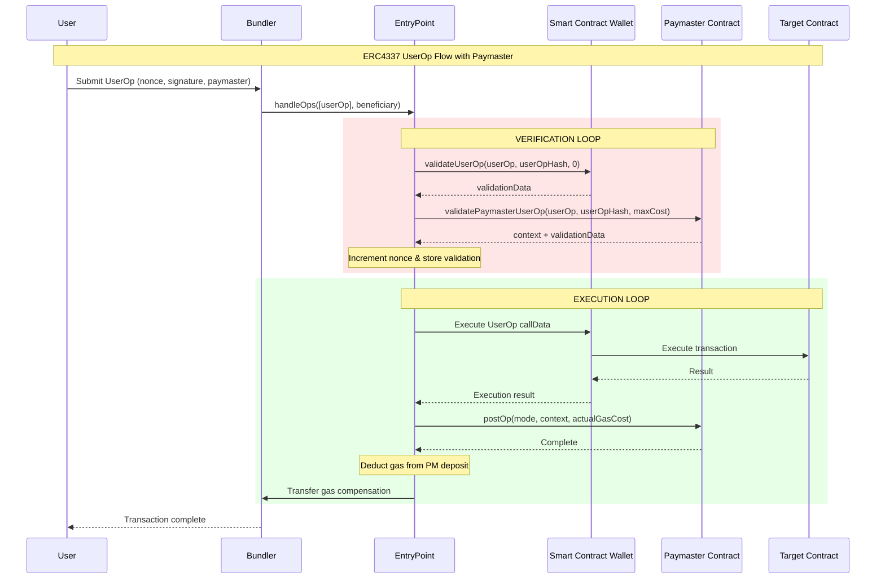
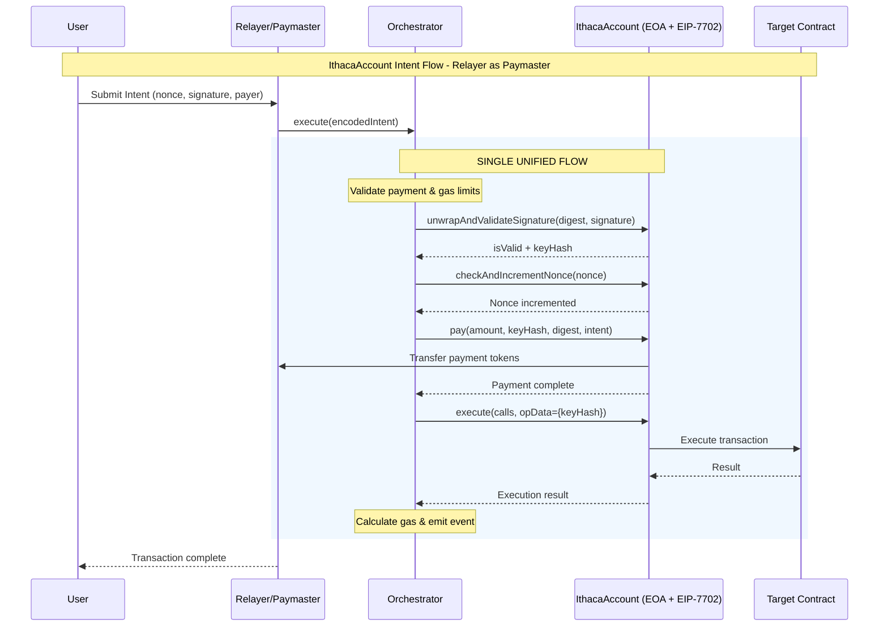

# ERC4337 UserOp vs IthacaAccount Intent: Execution Flow Comparison

## Overview

This document compares the execution flows of ERC4337 UserOperations with Paymaster support against IthacaAccount Intents with native paymaster capabilities. The key difference is that IthacaAccount integrates paymaster logic directly into the account contract, eliminating the need for separate paymaster contracts and complex deposit management.

## ERC4337 UserOp Execution with Paymaster



### Key Points - ERC4337:
- **Nonce Management**: 2D nonce system (192-bit key + 64-bit sequence) managed by EntryPoint's NonceManager
- **Two-phase execution**: Strict separation between verification and execution loops for security
- **Multiple contracts**: EntryPoint, Smart Contract Wallet, and Paymaster are separate contracts
- **Deposit management**: Both account and paymaster must maintain ETH deposits with EntryPoint
- **Signature validation**: Happens in validateUserOp within the Smart Contract Wallet
- **Gas calculation**: Complex prefund calculations and post-operation refunds
- **Context passing**: Paymaster can pass context from validation to post-operation

## IthacaAccount Intent Execution with Flexible Payment



### Key Points - IthacaAccount:
- **Nonce Management**: 2D nonce system (192-bit seqKey + 64-bit sequence) stored in account
- **Single-phase execution**: Unified verification and execution in one atomic flow
- **Integrated contracts**: Orchestrator and Account work together (no separate paymaster)
- **Direct payment**: Account transfers tokens directly to relayer
- **Signature validation**: Single unwrapAndValidateSignature call validates authorization
- **Gas calculation**: Simple gas measurement and direct compensation
- **Context passing**: KeyHash passed via opData parameter

## Comparison Summary

| Aspect | ERC4337 with Paymaster | IthacaAccount with Payment |
|--------|------------------------|-------------------------------------|
| **Architecture** | Three contracts (EntryPoint, SCW, Paymaster) | Two contracts (Orchestrator + Account) |
| **Execution Phases** | Two loops (verification + execution) | Single unified flow |
| **Nonce System** | 2D nonces (192-bit key + 64-bit sequence) | 2D nonces (192-bit key + 64-bit sequence) |
| **Nonce Storage** | EntryPoint's NonceManager | Account's nonceSeqs mapping |
| **Nonce Increment** | During verification loop | After validation, before payment |
| **Balance Checks** | Check paymaster deposit with EntryPoint | Check account balance directly |
| **Signature Validation** | validateUserOp + validatePaymasterUserOp | unwrapAndValidateSignature (unified) |
| **Payment Authorization** | Paymaster validates in separate call | Account validates payment signature |
| **Payment Timing** | After execution (postOp) | Before execution |
| **Payment Method** | Deduct from paymaster's EntryPoint deposit | Direct token transfer to relayer |
| **Gas Calculation** | Prefund estimation + actual cost + refund | Direct measurement after execution |
| **Validation Storage** | Store results between loops | No storage needed (single flow) |
| **Context Passing** | Return context from validation to postOp | Pass keyHash via opData |
| **Refund Handling** | Calculate and refund excess to account/PM | No refunds (exact payment) |
| **Failed Op Handling** | PostOp handles different failure modes | Revert prevents payment |
| **Gas Overhead** | Multiple external calls + ABI encoding | Fewer calls + assembly optimizations |

## Key Architectural Differences

### 1. **Execution Flow**
- **ERC4337**: Two-phase execution with separate verification and execution loops
- **IthacaAccount**: Single atomic flow combining verification, payment, and execution

### 2. **Payment Architecture**
- **ERC4337**: Requires separate paymaster contract with ETH deposits at EntryPoint
- **IthacaAccount**: Payment logic integrated into account, direct token transfers

### 3. **Gas Efficiency**
- **ERC4337**: Higher overhead from multiple external calls and ABI encoding
- **IthacaAccount**: ~2-3k gas savings through assembly optimizations and fewer calls

### 4. **Capital Requirements**
- **ERC4337**: Paymasters must lock ETH deposits with EntryPoint
- **IthacaAccount**: No deposits required, direct balance checks and transfers

### 5. **Failure Handling**
- **ERC4337**: PostOp function handles various failure modes after execution
- **IthacaAccount**: Atomic execution - failure prevents payment entirely

## Code Examples

### ERC4337 UserOp Structure and Validation
```solidity
// UserOperation structure in ERC4337
struct UserOperation {
    address sender;               // Smart contract account
    uint256 nonce;               // 2D nonce (key + sequence)
    bytes initCode;              // Account creation code (if needed)
    bytes callData;              // Execution data
    uint256 callGasLimit;        // Gas for execution
    uint256 verificationGasLimit;// Gas for validation
    uint256 preVerificationGas;  // Gas overhead
    uint256 maxFeePerGas;        // Max gas price
    uint256 maxPriorityFeePerGas;// Max priority fee
    bytes paymasterAndData;      // Paymaster address + data
    bytes signature;             // User signature
}

// In Smart Contract Wallet
function validateUserOp(
    UserOperation calldata userOp,
    bytes32 userOpHash,
    uint256 missingAccountFunds
) external returns (uint256 validationData) {
    // Validate nonce
    require(_validateNonce(userOp.nonce), "Invalid nonce");
    
    // Validate signature
    require(_validateSignature(userOp, userOpHash), "Invalid sig");
    
    // Pay prefund if no paymaster
    if (missingAccountFunds > 0) {
        payable(msg.sender).transfer(missingAccountFunds);
    }
    
    return _packValidationData(false, validUntil, validAfter);
}

// In Paymaster contract (external)
function validatePaymasterUserOp(
    UserOperation calldata userOp,
    bytes32 userOpHash,
    uint256 maxCost
) external returns (bytes memory context, uint256 validationData) {
    // Verify paymaster signature
    require(verifySignature(userOp, userOpHash), "PM: Invalid sig");
    
    // Check spending limits
    require(spendings[userOp.sender] + maxCost <= limits[userOp.sender], "PM: Limit exceeded");
    
    // Return context for postOp
    context = abi.encode(userOp.sender, maxCost);
    validationData = _packValidationData(false, validUntil, validAfter);
}

function postOp(
    PostOpMode mode,
    bytes calldata context,
    uint256 actualGasCost
) external {
    (address account, uint256 maxCost) = abi.decode(context, (address, uint256));
    
    // Update spending records
    spendings[account] += actualGasCost;
    
    // Handle refunds if needed
    if (mode == PostOpMode.opReverted) {
        // Handle failed operation
    }
}
```

### IthacaAccount Intent Structure with Flexible Payment
```solidity
// Intent structure in IthacaAccount
struct Intent {
    address eoa;                 // EOA with EIP-7702 delegation
    bytes executionData;         // ERC7579 batch execution
    uint256 nonce;              // 2D nonce (seqKey + sequence)
    address payer;              // Who pays (can be self or external)
    address paymentToken;       // ANY token (ERC20 or native)
    uint256 paymentMaxAmount;   // Max payment allowed
    uint256 combinedGas;        // Total gas limit
    bytes[] encodedPreCalls;    // Pre-execution calls
    bytes[] encodedFundTransfers;// Fund transfers (multichain)
    address settler;            // Settler address
    uint256 expiry;            // Expiration timestamp
    // Additional fields...
    address paymentRecipient;   // Relayer address for payment
    bytes signature;           // Main signature
    bytes paymentSignature;    // Payment authorization
}

// In IthacaAccount contract - Unified payment for any token type
function pay(
    uint256 paymentAmount,
    bytes32 keyHash,
    bytes32 intentDigest,
    bytes calldata encodedIntent
) public virtual {
    Intent calldata intent;
    // Extract intent from calldata (assembly for gas efficiency)
    assembly ("memory-safe") {
        let t := calldataload(encodedIntent.offset)
        intent := add(t, encodedIntent.offset)
        if or(shr(64, t), lt(encodedIntent.length, 0x20)) { 
            revert(0x00, 0x00) 
        }
    }
    
    // Validate caller must be Orchestrator
    if (!LibBit.and(
        msg.sender == ORCHESTRATOR,
        LibBit.or(intent.eoa == address(this), intent.payer == address(this))
    )) {
        revert Unauthorized();
    }
    
    // If account is self-sponsoring, validate payment signature
    if (intent.payer == address(this)) {
        (bool isValid, bytes32 k) = 
            unwrapAndValidateSignature(intentDigest, intent.paymentSignature);
        keyHash = k;  // Use payer's key
        
        // Allow simulation override
        if (tx.origin.balance >= type(uint192).max) {
            isValid = true;  // Simulation mode
        }
        
        if (!isValid) revert Unauthorized();
    }
    
    // UNIFIED TOKEN TRANSFER - works for ANY token type
    // address(0) = native ETH, any other address = ERC20
    TokenTransferLib.safeTransfer(
        intent.paymentToken,        // Can be ANY token
        intent.paymentRecipient,    // Relayer gets paid
        paymentAmount
    );
    
    // Track spending per key (not for super admin)
    if (!(keyHash == bytes32(0) || _isSuperAdmin(keyHash))) {
        SpendStorage storage spends = _getGuardedExecutorKeyStorage(keyHash).spends;
        _incrementSpent(spends.spends[intent.paymentToken], intent.paymentToken, paymentAmount);
    }
}

// TokenTransferLib handles both native and ERC20 uniformly
library TokenTransferLib {
    function safeTransfer(address token, address to, uint256 amount) internal {
        if (token == address(0)) {
            // Native ETH transfer
            assembly {
                if iszero(call(gas(), to, amount, 0, 0, 0, 0)) {
                    revert(0, 0)
                }
            }
        } else {
            // ERC20 transfer - same interface
            assembly {
                let m := mload(0x40)
                mstore(m, 0xa9059cbb)  // transfer(address,uint256)
                mstore(add(m, 0x20), to)
                mstore(add(m, 0x40), amount)
                if iszero(call(gas(), token, 0, add(m, 0x1c), 0x44, 0, 0x20)) {
                    revert(0, 0)
                }
            }
        }
    }
}

// Nonce management in account
function checkAndIncrementNonce(uint256 nonce) public payable virtual {
    if (msg.sender != ORCHESTRATOR) revert Unauthorized();
    
    // Extract seqKey and sequence
    uint192 seqKey = uint192(nonce >> 64);
    uint64 sequence = uint64(nonce);
    
    // Validate and increment
    LibNonce.checkAndIncrement(_getAccountStorage().nonceSeqs, nonce);
}
```

## Conclusion

Both ERC4337 and IthacaAccount provide solutions for sponsored transactions, but with fundamentally different architectures:

**ERC4337** implements a robust, standardized approach with:
- Clear separation of concerns across three contracts
- Two-phase execution ensuring validation before execution
- Paymaster deposits providing guaranteed compensation
- PostOp handling for various failure scenarios

**IthacaAccount** takes a streamlined approach with:
- Integrated payment logic within the account contract
- Single atomic execution flow
- Direct token transfers without deposits
- Gas savings through assembly optimizations

The core trade-off is between ERC4337's modularity and standardization versus IthacaAccount's efficiency and simplicity. ERC4337's separate paymaster contracts provide flexibility for complex payment logic and risk management, while IthacaAccount's integrated approach reduces gas costs and eliminates deposit requirements.

For applications prioritizing:
- **Standards compliance and modularity**: ERC4337 provides a battle-tested framework
- **Gas efficiency and simplicity**: IthacaAccount offers lower costs and simpler integration
- **Complex payment logic**: ERC4337's separate paymaster contracts offer more flexibility
- **Direct token payments**: IthacaAccount's integrated approach eliminates intermediaries

Both approaches successfully enable gasless transactions, with the choice depending on specific requirements around gas costs, complexity tolerance, and integration preferences.