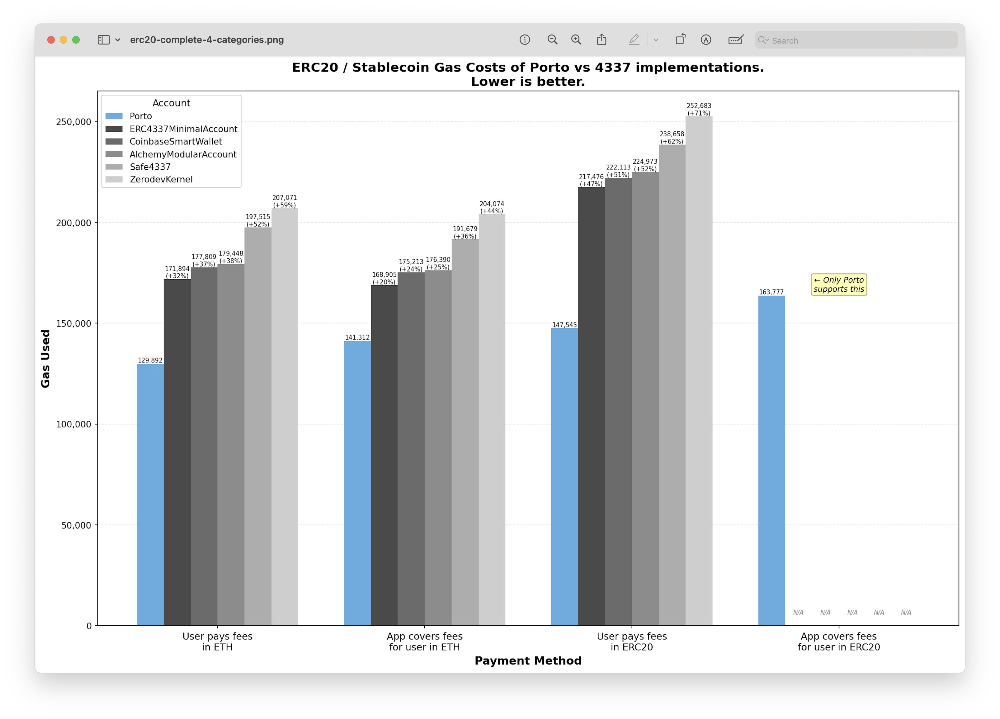

# <h1 align="center"> Account </h1>

**All-in-one EIP-7702 powered account contract, coupled with [Porto](https://github.com/ithacaxyz/porto)**

Every app needs an account, traditionally requiring separate services for auth, payments, and recovery. Doing this in a way that empowers users with control over their funds and their data is the core challenge of the crypto space. While crypto wallets have made great strides, users still face a fragmented experience - juggling private keys, managing account balances across networks,
having to install browser extensions, and more.

We believe that unstoppable crypto-powered accounts should be excellent throughout a user's journey:

- **Onboarding**: No key management using WebAuthn and Passkeys. KYC-less fiat onramping. No kicking of the user to 3rd party applications, fully embedded experience with headless wallet.
- **Verifying their identity**: Privacy-preserving identity verification with [ZK Passport](https://www.openpassport.app/) or other techniques.
- **Transacting safely**: Access [control policies](src/GuardedExecutor.sol) baked in with sensible defaults in smart contracts.
- **Transacting privately**: Built-in privacy using [stealth addresses](https://vitalik.eth.limo/general/2023/01/20/stealth.html) or other designs.
- **Transacting seamlessly across chains**: Single address with automatic fund transfers between chains.
- **Recovering their account**: Multi-path recovery via social, [email](https://github.com/zkemail), [OAuth](https://github.com/olehmisar/zklogin/pull/2), or other identity providers.
- **No vendor lock-in**: No vendor lock-in, built on top of standards that have powered Ethereum for years.

# Features out of the box

- Secure Login: Using WebAuthN-compatible credentials like PassKeys.
- Call Batching: Send multiple calls in 1.
- Gas Sponsorship: Allow anyone to pay for your fees in any ERC20 or ETH.
- Access Control: Whitelist receivers, function selectors and arguments.
- Session Keys: Allow transactions without confirmations if they pass low-security access control policies.
- Multi-sig Support: If a call is outside of a certain access control policy, require multiple signatures.
- Interop: Transaction on any chain invisibly. 

## Benchmarks

Gas benchmark implementations are in the [test repository](test/Benchmark.t.sol). We currently benchmark against leading ERC-4337 accounts. We use `forge snapshot --isolate` to generate the benchmarks.

The benchmarks here measure the cost of common operations - an ERC20 token transfer, a native token transfer, and a Uni V2 swap. We bench across different payment modes (self-paying in native tokens, paying in ERC-20 tokens, and using a paymaster).

For each of the above benchmarks, we further generate 2 sets of benchmarks:
1. Maximum cost - this benchmark uses a fresh account, and sends an unbatched user operation or intent transaction.
2. Average cost - this benchmark uses an account that sent a user operation or intent previously, and the uo/intent is relayed in a batch of 10.

Across all benchmarks, the Porto smart account is the cheapest account.

## Security
Contracts were audited in a 2 week engagement by @MiloTruck @rholterhus @kadenzipfel

We also maintain an active bug bounty program, you can find more details about it [here](https://porto.sh/contracts/security-and-bug-bounty)

## Getting Help

Have questions or building something cool with Porto Accounts?  
Join the Telegram group to chat with the team and other devs: [@porto_devs](https://t.me/porto_devs)
