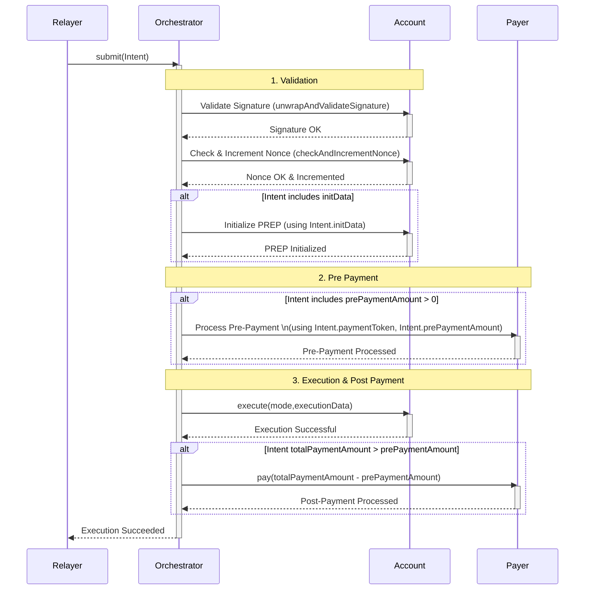

```mermaid
sequenceDiagram
    participant Relayer
    participant Orchestrator
    participant Account
    participant Payer 

    Relayer->>Orchestrator: submit(Intent)
    activate Orchestrator

    note over Orchestrator,Account: 1. Validation
    Orchestrator->>Account: Validate Signature (unwrapAndValidateSignature)
    activate Account
    Account-->>Orchestrator: Signature OK
    deactivate Account

    Orchestrator->>Account: Check & Increment Nonce (checkAndIncrementNonce)
    activate Account
    Account-->>Orchestrator: Nonce OK & Incremented
    deactivate Account

    alt Intent includes initData
        Orchestrator->>Account: Initialize PREP (using Intent.initData)
        activate Account
        Account-->>Orchestrator: PREP Initialized
        deactivate Account
    end

    note over Orchestrator,Payer: 2. Pre Payment
    alt Intent includes prePaymentAmount > 0
        Orchestrator->>Payer: Process Pre-Payment \n(using Intent.paymentToken, Intent.prePaymentAmount)
        activate Payer
        Payer-->>Orchestrator: Pre-Payment Processed
        deactivate Payer
    end

    note over Orchestrator,Payer: 3. Execution & Post Payment
    Orchestrator->>Account: execute(mode,executionData)
    activate Account
    Account-->>Orchestrator: Execution Successful
    deactivate Account

    alt Intent totalPaymentAmount > prePaymentAmount
        Orchestrator->>Payer: pay(totalPaymentAmount - prePaymentAmount)
        activate Payer
        Payer-->>Orchestrator: Post-Payment Processed
        deactivate Payer
    end

    Orchestrator-->>Relayer: Execution Succeeded
    deactivate Orchestrator
```