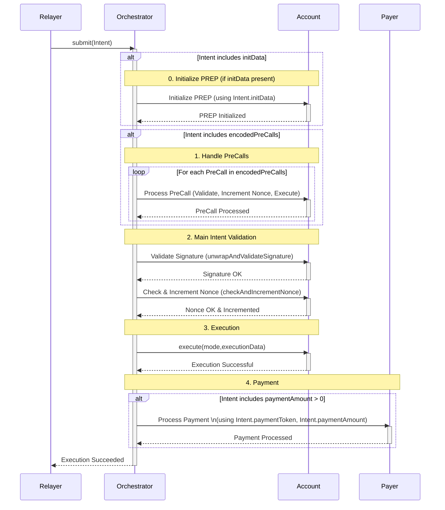

```mermaid
sequenceDiagram
participant Relayer
participant Orchestrator
participant Account
participant Payer

    Relayer->>Orchestrator: submit(Intent)
    activate Orchestrator

    alt Intent includes initData
        note over Orchestrator,Account: 0. Initialize PREP (if initData present)
        Orchestrator->>Account: Initialize PREP (using Intent.initData)
        activate Account
        Account-->>Orchestrator: PREP Initialized
        deactivate Account
    end

    alt Intent includes encodedPreCalls
        note over Orchestrator,Account: 1. Handle PreCalls
        loop For each PreCall in encodedPreCalls
            Orchestrator->>Account: Process PreCall (Validate, Increment Nonce, Execute)
            activate Account
            Account-->>Orchestrator: PreCall Processed
            deactivate Account
        end
    end

    note over Orchestrator,Account: 2. Main Intent Validation
    Orchestrator->>Account: Validate Signature (unwrapAndValidateSignature)
    activate Account
    Account-->>Orchestrator: Signature OK
    deactivate Account

    Orchestrator->>Account: Check & Increment Nonce (checkAndIncrementNonce)
    activate Account
    Account-->>Orchestrator: Nonce OK & Incremented
    deactivate Account

    note over Orchestrator,Account: 3. Execution
    Orchestrator->>Account: execute(mode,executionData)
    activate Account
    Account-->>Orchestrator: Execution Successful
    deactivate Account

    note over Orchestrator,Payer: 4. Payment
    alt Intent includes paymentAmount > 0
        Orchestrator->>Payer: Process Payment \n(using Intent.paymentToken, Intent.paymentAmount)
        activate Payer
        Payer-->>Orchestrator: Payment Processed
        deactivate Payer
    end

    Orchestrator-->>Relayer: Execution Succeeded
    deactivate Orchestrator
```